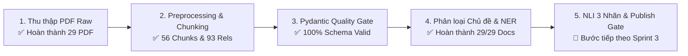

# HƯỚNG DẪN XỬ LÝ DỮ LIỆU & QUY TRÌNH HỆ THỐNG (DATA & PIPELINE GUIDE)
## Dự Án: DAU Second Brain

> **Tài liệu liên quan:** [DAU_Second_Brain_Ke_Hoach_Du_Lieu.md](file:///Users/macbookair/Desktop/AI_Second_Brain_DAU/docs/DAU_Second_Brain_Ke_Hoach_Du_Lieu.md) | [workflow.md](file:///Users/macbookair/Desktop/AI_Second_Brain_DAU/docs/workflow.md) | [DAU_Second_Brain_Dac_Ta_Nghiep_Vu_Kien_Truc.md](file:///Users/macbookair/Desktop/AI_Second_Brain_DAU/docs/DAU_Second_Brain_Dac_Ta_Nghiep_Vu_Kien_Truc.md) | [DAU_Second_Brain_Phan_Cong_RACI.md](file:///Users/macbookair/Desktop/AI_Second_Brain_DAU/docs/DAU_Second_Brain_Phan_Cong_RACI.md)

Tài liệu này tổng hợp toàn bộ quy trình thiết lập môi trường, thu thập dữ liệu tự động, tiền xử lý, chia đoạn (Structure Chunking), định dạng Data Model Schemas, kiểm duyệt tính hợp lệ với Pydantic (Data Quality Gate), quản trị rủi ro và các chỉ số nghiệm thu KPI.

---

## I. TRẠNG THÁI TIẾN ĐỘ DỰ ÁN (PROJECT PROGRESS STATUS)



- ✅ **Bước 1 (Thu thập dữ liệu)**: Đã cào và lưu trữ 29 văn bản PDF phân loại thành 3 danh mục chính tại `data/raw/` (`thong_tu/`, `quyet_dinh/`, `quy_che_noi_bo/`).
- ✅ **Bước 2 (Tiền xử lý & Chunking)**: Script `services/ingestion/preprocess.py` đã trích xuất text chuẩn NFC, cắt đoạn theo Điều/Khoản kèm số trang PDF gốc (`so_trang`) và trích xuất 5 loại quan hệ `DocumentRelation`.
- ✅ **Bước 3 (Pydantic Quality Gate)**: Script `services/ingestion/validate_data.py` đã kiểm duyệt 100% hợp lệ cho 29 Documents, 56 Chunks, 93 Relations và 45 mẫu Faithfulness Testset.
- ✅ **Bước 4 (Phân loại Chủ đề & NER)**: Script `services/extraction/extract_and_classify.py` đã phân loại 100% văn bản vào 5 chủ đề `TopicEnum` (`DAO_TAO`: 15, `CO_SO_VAT_CHAT`: 5, `NHAN_SU`: 4, `TUYEN_SINH`: 4, `TAI_CHINH`: 1, `KHAC`: 0) và trích xuất đầy đủ thực thể NER.
- 🔄 **Bước 5 (Công việc tiếp theo)**: Đánh giá NLI 3 nhãn (`entailment`, `neutral`, `contradiction`) và Review Service Publish Gate (`services/review_service/publish_gate.py`).

---

## II. THIẾT LẬP MÔI TRƯỜNG & CẤU TRÚC DỮ LIỆU

### 1. Chuẩn bị môi trường làm việc
- **Python**: Version `3.10+` (khuyên dùng `.venv` trong dự án).
- **Dependencies**: `pdfplumber`, `pymupdf` (`fitz`), `pandas`, `pydantic`, `requests`, `beautifulsoup4`.
- **Cài đặt**:
  ```bash
  python3 -m venv .venv
  source .venv/bin/activate
  pip install pdfplumber pymupdf pandas pydantic requests beautifulsoup4 python-dotenv
  ```

### 2. Cấu trúc thư mục chuẩn
```
data/
├── raw/
│   ├── thong_tu/              # Các Thông tư Bộ GD&ĐT & Chính phủ
│   ├── quyet_dinh/            # Các Quyết định Bộ GD&ĐT & Chính phủ
│   └── quy_che_noi_bo/        # Tài liệu & Quy định nội bộ DAU
├── processed/
│   ├── documents.jsonl        # Metadata văn bản chuẩn DocumentSchema
│   ├── chunks.jsonl           # Đoạn cắt Điều/Khoản chuẩn DocumentChunkSchema
│   └── document_relations.jsonl# Quan hệ văn bản chuẩn DocumentRelationSchema
└── testset/
    └── faithfulness_samples.json# Tập test NLI 3 nhãn chuẩn FaithfulnessSampleSchema
logs/
├── ingestion_errors.log       # Log lỗi cào văn bản
└── extraction_errors.log      # Log lỗi trích xuất text/OCR
```

---

## III. ĐỊNH DẠNG CHUẨN 4 SCHEMAS ĐẦU RA (DATA MODEL)

### 📄 1. Schema Metadata Văn Bản (`data/processed/documents.jsonl`)
Mỗi dòng là đối tượng JSON `DocumentSchema`:
```json
{
  "doc_id": "BGD_TT_082021_QuyCheDaoTaoDaiHoc",
  "so_hieu": "08/2021/TT-BGDĐT",
  "ten_van_ban": "Thông tư 08/2021/TT-BGDĐT: Quy chế đào tạo trình độ đại học",
  "co_quan_ban_hanh": "Bộ Giáo dục và Đào tạo",
  "ngay_ban_hanh": "2021-03-18",
  "loai_van_ban": "Thông tư",
  "trich_yeu": "Ban hành quy chế đào tạo trình độ đại học áp dụng cho các cơ sở giáo dục đại học.",
  "chu_de": "DAO_TAO",
  "muc_do_lien_quan_dau": "GENERAL",
  "trang_thai_xuat_ban": "PENDING_REVIEW",
  "can_cu_dan_chieu": ["Luật Giáo dục đại học số 34/2018/QH14"],
  "file_path": "data/raw/thong_tu/BGD_TT_082021_QuyCheDaoTaoDaiHoc.pdf"
}
```

### 🧩 2. Schema Chunk Đoạn Văn Bản (`data/processed/chunks.jsonl`)
Mỗi dòng là đối tượng JSON `DocumentChunkSchema` (kèm `so_trang` cho tính năng xem file gốc):
```json
{
  "chunk_id": "BGD_TT_082021_QuyCheDaoTaoDaiHoc_D5_K1",
  "doc_id": "BGD_TT_082021_QuyCheDaoTaoDaiHoc",
  "so_hieu": "08/2021/TT-BGDĐT",
  "dieu_so": 5,
  "khoan_so": 1,
  "so_trang": 4,
  "title": "Điều 5. Điều kiện cảnh báo học tập",
  "content": "Điều 5. Điều kiện cảnh báo học tập\n1. Sinh viên có điểm trung bình học kỳ dưới 1.0 sẽ bị cảnh báo học tập lần 1.",
  "token_count": 48,
  "chu_de": "DAO_TAO",
  "muc_do_lien_quan_dau": "GENERAL"
}
```

### 🕸️ 3. Schema Quan Hệ Văn Bản (`data/processed/document_relations.jsonl`)
Mỗi dòng là mối quan hệ `DocumentRelationSchema` giữa 2 văn bản:
```json
{
  "relation_id": "rel_001",
  "document_id_a": "BGD_TT_082021_QuyCheDaoTaoDaiHoc",
  "document_id_b": "34_2018_QH14",
  "loai_quan_he": "CAN_CU",
  "mo_ta": "Căn cứ Luật Giáo dục đại học số 34/2018/QH14",
  "diem_tuong_dong": null
}
```

### 🧪 4. Schema Tập Kiểm Thử Faithfulness Audit (`data/testset/faithfulness_samples.json`)
Danh sách mẫu NLI 3 nhãn (`entailment`, `neutral`, `contradiction`) phục vụ đánh giá chống bịa đặt:
```json
[
  {
    "sample_id": "test_001",
    "doc_id": "BGD_TT_082021_QuyCheDaoTaoDaiHoc",
    "chunk_id": "BGD_TT_082021_QuyCheDaoTaoDaiHoc_D5_K1",
    "premise": "Sinh viên có điểm trung bình học kỳ dưới 1.0 sẽ bị cảnh báo học tập lần 1.",
    "hypothesis": "Sinh viên có điểm học kỳ 0.9/4.0 sẽ bị nhận cảnh báo học tập.",
    "label": "entailment",
    "notes": "Suy luận đúng 100% từ đoạn văn bản gốc"
  }
]
```

---

## IV. QUY TRÌNH THỰC THI PIPELINE THEO CÁC BƯỚC

### Bước 1: Thu thập Dữ liệu Văn bản Tự động (`services/ingestion/crawl_documents.py`)
- **Mục tiêu**: Tải các file PDF Thông tư & Quyết định chính thức từ `moet.gov.vn` hoặc `vanban.chinhphu.vn`.
- **Lệnh thực thi**:
  ```bash
  .venv/bin/python services/ingestion/crawl_documents.py --max_files 50 --output_dir data/raw
  ```
- **Quản trị rủi ro luồng cào**:
  > [!WARNING]
  > - **Retry & Rate-Limit**: Tự động áp dụng Exponential Backoff Retry (ngủ 2s–5s, tối đa 3 lần thử lại) khi gặp lỗi kết nối 429/403.
  > - **Kiểm soát PDF Binary**: Kiểm tra header bọc `res.content.startswith(b'%PDF')` ngăn lưu nhầm file lỗi HTML/404.
  > - **Log lỗi**: Ghi vết ngoại lệ kết nối vào `logs/ingestion_errors.log`.

---

### Bước 2: Preprocessing & Structure Chunking (`services/ingestion/preprocess.py`)
- **Mục tiêu**: Đọc toàn bộ PDF raw, trích xuất text chuẩn Unicode NFC, cắt đoạn theo Điều/Khoản (`so_trang`), bóc tách mối quan hệ liên văn bản (`CAN_CU`, `THAY_THE`, `SUA_DOI`, `BAI_BO`).
- **Lệnh thực thi**:
  ```bash
  .venv/bin/python services/ingestion/preprocess.py --input_dir data/raw --output_dir data/processed
  ```
- **Quản trị rủi ro trích xuất**:
  > [!IMPORTANT]
  > - **Fallback OCR**: Nếu PDF là ảnh scan hoặc mã hóa lỗi font (số từ < 20 từ/trang), hệ thống tự động kích hoạt luồng Fallback OCR (`PaddleOCR` / `PyTesseract`).
  > - **Log lỗi trích xuất**: Mọi đoạn chunk lỗi được ghi vết vào `logs/extraction_errors.log`.

---

### Bước 3: Kiểm duyệt Hợp lệ Dữ liệu với Pydantic (`services/ingestion/validate_data.py`)
- **Mục tiêu**: Đảm bảo 100% dữ liệu đầu ra đạt chuẩn Pydantic Schema trước khi đưa vào các bước tiếp theo.
- **Lệnh thực thi**:
  ```bash
  .venv/bin/python services/ingestion/validate_data.py
  ```
- **Kết quả kiểm duyệt thực tế**:
  - ✅ **Documents**: 29/29 văn bản hợp lệ 100%.
  - ✅ **Chunks**: 56/56 đoạn hợp lệ 100%.
  - ✅ **Relations**: 93/93 quan hệ hợp lệ 100%.
  - ✅ **Faithfulness Samples**: 45/45 mẫu NLI hợp lệ 100%.

---

### Bước 4 (BƯỚC TIẾP THEO): Phân Loại Chủ Đề & Trích Xuất Thực Thể NER (`services/extraction/extract_and_classify.py`)
- **Mục tiêu**: Thực hiện **EPIC-2 (Sprint 2)** theo phân công RACI:
  1. Phân loại tự động **Loại văn bản**: `Thông tư`, `Quyết định`, `Nghị định`, `Công văn`, `Luật`, `Quy định`.
  2. Gán nhãn tự động **Chủ đề (`TopicEnum`)**: `DAO_TAO`, `TUYEN_SINH`, `TAI_CHINH`, `NHAN_SU`, `CO_SO_VAT_CHAT`, `KHAC`.
  3. Trích xuất thực thể NER: Số hiệu, Cơ quan ban hành, Ngày ban hành, Trích yếu, Yêu cầu báo cáo & Hạn nộp.
- **Lệnh thực thi**:
  ```bash
  .venv/bin/python services/extraction/extract_and_classify.py --input_dir data/processed --output_dir data/processed
  ```

---

### Bước 5: Đánh Giá NLI 3 Nhãn & Review Service Publish Gate (`services/review_service/publish_gate.py`)
- **Mục tiêu**: Thực hiện **EPIC-3 (NLI 3 nhãn)** và **EPIC-9 (Review Service - Sprint 3)**:
  1. Văn bản mới Ingestion mặc định ở trạng thái `trang_thai_xuat_ban = "PENDING_REVIEW"`.
  2. Phân loại NLI 3 nhãn: `entailment`, `neutral`, `contradiction`.
  3. **Ràng buộc an toàn FR-08**: Nếu có ít nhất 1 câu `contradiction` ➔ Chuyển toàn bộ văn bản vào hàng đợi rà soát, ngăn tự động chuyển `published`.
- **Lệnh thực thi**:
  ```bash
  .venv/bin/python services/review_service/publish_gate.py --input_dir data/processed --testset data/testset/faithfulness_samples.json
  ```

---

## V. BỘ CHỈ SỐ KPIS NGHỆM THU CHẤT LƯỢNG

Bảng dưới đây quy định các ngưỡng chỉ số đo lường chất lượng tối thiểu bắt buộc hệ thống phải đạt được trước khi nghiệm thu:

| Hạng mục Đo lường | Chỉ số KPI / Metric | Ngưỡng Đạt Tối Thiểu | Ghi chú & Phương pháp Kiểm thử |
|---|---|---|---|
| **Luồng Cào dữ liệu (Crawler)** | Tỷ lệ cào tệp PDF thành công | **> 95% links** | Không bị ngắt tiến trình, 100% tệp lưu chuẩn `%PDF-1.` binary |
| **Kiểm duyệt Schema (Data Gate)** | Tính hợp lệ Pydantic Schema | **100% hợp lệ** | Không có bất kỳ lỗi `ValidationError` nào trên `documents`, `chunks`, `relations` |
| **Trích xuất NER & Chủ đề** | Độ chính xác F1-Score | **> 85%** | Đánh giá trên tập nhãn mẫu (Số hiệu, Ngày BH, Loại VB, Chủ đề) |
| **Độ chính xác Mô hình NLI** | Accuracy NLI 3 Nhãn | **> 85%** | Đánh giá trên tập `data/testset/faithfulness_samples.json` |
| **Publish Gate Safety (FR-08)** | Tỷ lệ chặn câu `contradiction` | **100% chặn tuyệt đối** | 100% văn bản chứa mâu thuẫn/bịa đặt bị giữ lại `PENDING_REVIEW` |
| **Hiệu năng xử lý (Performance)** | Thời gian Preprocessing / PDF | **< 3 giây / PDF** | Đảm bảo tốc độ xử lý hàng loạt tốt trên môi trường tiêu chuẩn |

---

## VI. BẢNG PHÂN CÔNG VAI TRÒ (NHÓM RACI)

| Hạng mục Công việc | TV1 (Track A - Data & Pipeline) | TV2 (Track B - AI Core) |
|---|---|---|
| **Thu thập PDF chinhphu.vn & MOET** | **R / A** (Thực hiện chính) | **C** (Tư vấn nguồn) |
| **Viết Script Preprocessing & Chunking** | **R / A** (Thực hiện chính) | **C** (Đóng góp regex) |
| **Trích xuất Quan Hệ DocumentRelation** | **R / A** (Thực hiện chính) | **C** (Tư vấn similarity) |
| **Phân loại Chủ đề & NER (EPIC-2)** | **R / A** (Thực hiện chính) | **C** (Review chất lượng) |
| **NLI 3 Nhãn & Review Service (EPIC-3, 9)** | **R / A** (Cùng thực hiện) | **R / A** (Cùng thực hiện) |
