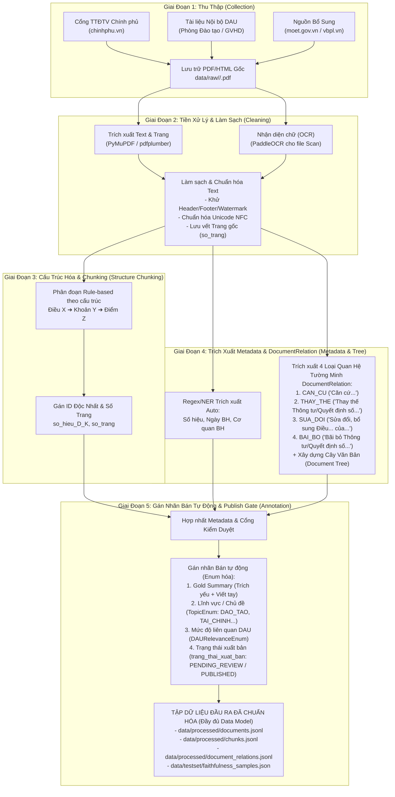

# QUY TRÌNH XỬ LÝ VÀ CHUẨN BỊ DỮ LIỆU (DATA WORKFLOW)
## Dự Án: DAU Second Brain

> **Tài liệu tham chiếu chính:** [DAU_Second_Brain_Ke_Hoach_Du_Lieu.md](file:///e:/AISCBRAINDAU/docs/DAU_Second_Brain_Ke_Hoach_Du_Lieu.md) | [DAU_Second_Brain_Dac_Ta_Nghiep_Vu_Kien_Truc.md](file:///e:/AISCBRAINDAU/docs/DAU_Second_Brain_Dac_Ta_Nghiep_Vu_Kien_Truc.md) (Quy trình WF-01 & DocumentRelation)  
> **Ràng buộc:** Thực hiện bởi nhóm 2 người trong 12 tuần — 100% dữ liệu cào từ **chinhphu.vn** và **tài liệu nội bộ Trường ĐH Kiến trúc Đà Nẵng (DAU)**.

---

## 1. Tổng Quan Luồng Xử Lý (Workflow Diagram)

---

## 2. Chi Tiết Các Giai Đoạn Trong Workflow

### 🔹 Giai Đoạn 1: Thu Thập Dữ Liệu (Collection)
- **Mục tiêu:** Thu thập 20 – 30 (khuyến nghị 30 – 40) văn bản quy phạm pháp luật giáo dục và quy chế nội bộ DAU.
- **Tiêu chuẩn lưu trữ:**
  - File PDF gốc: `data/raw/<loai_van_ban>/<so_hieu_chuan_hoa>.pdf`
  - Nhật ký thu thập: `data/raw/metadata.csv` (lưu URL nguồn, ngày tải, người tải, trạng thái bản quyền/phạm vi cho phép).

### 🔹 Giai Đoạn 2: Tiền Xử Lý & Làm Sạch (Preprocessing & Cleaning)
- **Đầu vào:** File PDF/Scan từ `data/raw/`.
- **Quy trình xử lý:**
  1. Đọc văn bản thô qua `PyMuPDF` (`fitz`), lưu vết chỉ số trang (`page_number`). Nếu tỷ lệ ký tự trống quá cao ➔ Chuyển qua `PaddleOCR`.
  2. Xóa các nhiễu định dạng lặp lại:
     - Số trang, tiêu đề đầu trang/cuối trang (Header/Footer).
     - Dấu vết OCR lỗi, khoảng trắng thừa, ký tự điều khiển ngắt dòng sai.
  3. Chuẩn hóa tiếng Việt tổ hợp về Unicode **NFC**.

### 🔹 Giai Đoạn 3: Cấu Trúc Hóa & Chunking Theo Điều/Khoản
- **Nguyên tắc:** KHÔNG chunk theo độ dài token cố định. Cắt đoạn theo đơn vị ngữ nghĩa **Điều / Khoản / Điểm**.
- **Cấu trúc Regex:**
  - Đỉnh Điều: `r"Điều\s+(\d+)\.\s*(.*)"`
  - Đỉnh Khoản: `r"^(\d+)\.\s+(.*)"`
- **Mỗi Chunk nhận được thông tin (Chuẩn Data Model `DocumentChunk`):**
  - `chunk_id`: Ví dụ `08_2024_TT_BGDDT_D5_K2`
  - `doc_id`: `08_2024_TT_BGDDT`
  - `dieu_so`: 5
  - `khoan_so`: 2
  - `so_trang`: Trang tương ứng trong file PDF gốc (phục vụ tính năng "Xem văn bản gốc" / Màn hình 4).
  - `content`: Nội dung đầy đủ của Khoản 2 Điều 5.

### 🔹 Giai Đoạn 4: Trích Xuất Metadata & Đầy Đủ Các Loại Quan Hệ `DocumentRelation`
- **Trích xuất thuộc tính cố định (NER Rule):**
  - **Số hiệu:** `r"Số:\s*(\d+/\d+/[A-ZĐ-–-]+)"`
  - **Ngày ban hành:** `r"ngày\s+(\d{1,2})\s+tháng\s+(\d{1,2})\s+năm\s+(\d{4})"`
  - **Cơ quan ban hành:** `r"(Bộ Giáo dục và Đào tạo|Chính phủ|Trường Đại học Kiến trúc Đà Nẵng)"`
- **Trích xuất đầy đủ 4 loại quan hệ tường minh (Rule-based) + 1 quan hệ ngữ nghĩa trong `DocumentRelation.loai_quan_he` (Phục vụ Cây Văn Bản / WF-06):**
  1. **`CAN_CU` (Căn cứ):** Regex bắt các câu mở đầu *"Căn cứ [tên/số hiệu văn bản]..."* để xây dựng cây căn cứ pháp lý.
  2. **`THAY_THE` (Thay thế):** Regex bắt các cụm *"Thông tư/Quyết định này thay thế Thông tư/Quyết định số [số hiệu]..."* ở điều khoản thi hành.
  3. **`SUA_DOI` (Sửa đổi / Bổ sung):** Regex bắt các cụm *"Sửa đổi, bổ sung Điều [X] của Thông tư/Quyết định số [số hiệu]..."*.
  4. **`BAI_BO` (Bãi bỏ):** Regex bắt các cụm *"Bãi bỏ Quyết định/Thông tư số [số hiệu]..."* hoặc *"Điều [X] của Quyết định [Y] hết hiệu lực..."*.
  5. **`LIEN_QUAN_NGU_NGHIA` (Liên quan ngữ nghĩa):** Tính toán độ tương đồng cosine giữa các embedding đoạn văn bản trong Vector DB.

### 🔹 Giai Đoạn 5: Gán Nhãn Bán Tự Động, Enum Hóa & Publish Gate
1. **Gold Summary (Tóm tắt chuẩn):**
   - Trích xuất mục *"Trích yếu"* có sẵn ở đầu văn bản.
   - Với 20-30 văn bản trong tập Đánh giá: 2 thành viên rà soát và tinh chỉnh tay 2-3 câu tóm tắt đúc kết chính.
2. **Enum hóa danh mục cố định (Topic & Relevance):**
   - **`chu_de` (TopicEnum):** `DAO_TAO`, `TAI_CHINH`, `NHAN_SU`, `TUYEN_SINH`, `CO_SO_VAT_CHAT`, `KHAC`.
   - **`muc_do_lien_quan_dau` (DAURelevanceEnum):**
     - `DIRECT`: Áp dụng trực tiếp (Văn bản nội bộ DAU).
     - `GENERAL`: Áp dụng chung (Thông tư Bộ/Nghị định Chính phủ).
     - `REFERENCE`: Tham khảo chuyên ngành.
3. **Cơ chế Cổng Kiểm Duyệt (`trang_thai_xuat_ban`):**
   - **`trang_thai_xuat_ban` (PublishStatusEnum):** `PENDING_REVIEW` (chờ kiểm duyệt), `PUBLISHED` (đã xuất bản), `REJECTED` (từ chối do phát hiện bịa đặt/contradiction).
   - Mặc định văn bản mới nạp vào ở trạng thái `PENDING_REVIEW`. Chỉ xuất bản khi vượt qua bước Faithfulness Check.
4. **Tập Đánh Giá Faithfulness Audit (NLI Pairs 3 Nhãn):**
   - Xây dựng 20-30 cặp `(Premise - Chunk gốc, Hypothesis - Câu tóm tắt/câu trả lời, Label)` với đầy đủ 3 nhãn NLI:
     - `entailment`: Đúng / Trích dẫn chuẩn.
     - `neutral`: Trung lập / Không đủ căn cứ xác nhận từ văn bản.
     - `contradiction`: Mâu thuẫn / Bịa đặt thông tin.

---

## 3. Kiểm Soát Chất Lượng Dữ Liệu (Quality Assurance)

- **Trùng lặp:** Kiểm tra số hiệu văn bản trùng lặp trước khi đưa vào pipeline.
- **Lỗi OCR:** Loại bỏ văn bản có tỷ lệ lỗi OCR > 5% khỏi tập testset đánh giá.
- **Bảo mật & Đạo đức:** Văn bản nội bộ DAU phải có sự cho phép của GVHD/Phòng Đào tạo; loại bỏ mọi thông tin cá nhân (PII) của sinh viên/giảng viên.
